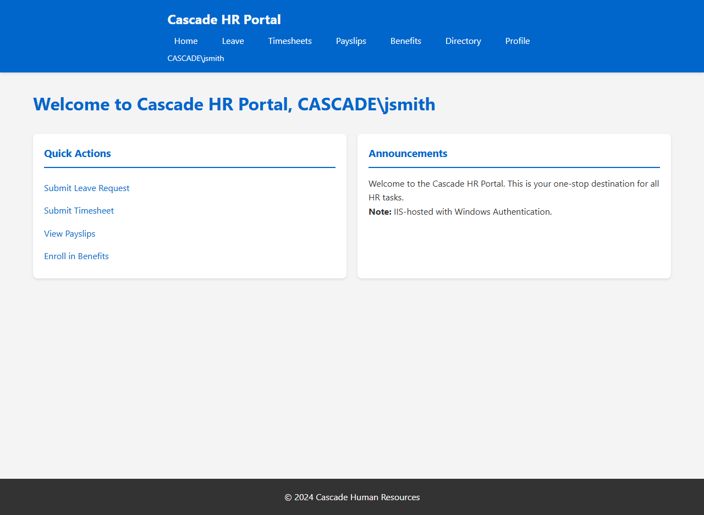
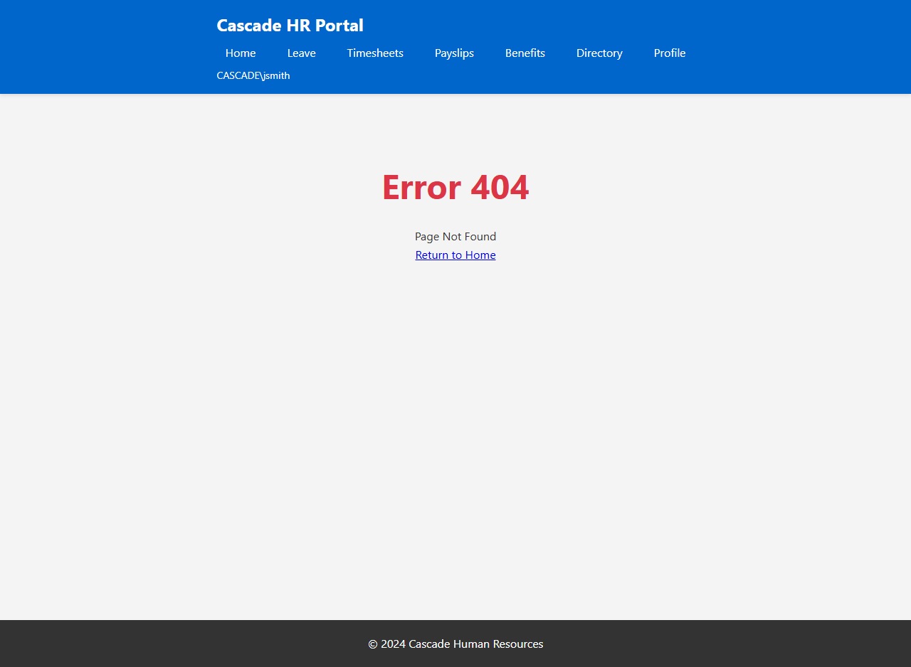

## Legacy Application Overview

Cascade HR Portal is an ASP.NET Core 6.0 employee self-service application hosted on IIS 10 (Windows Server 2019). The application relies heavily on IIS-specific features including 20+ URL rewrite rules, Windows Authentication (Negotiate/NTLM), virtual directories pointing to network file shares, and custom error pages — all of which must be migrated to Azure App Service equivalents.

### HR Portal Dashboard

The main landing page provides quick access to Leave, Timesheet, Payslips, and Benefits modules. Note the Windows-authenticated user identity (CASCADE\jsmith) displayed in the navigation bar — a key IIS dependency that requires migration to Entra ID Easy Auth.

### IIS Error Handling

Custom error pages are rendered via `UseStatusCodePagesWithReExecute`, part of the IIS error-handling configuration that needs to be replaced with ASP.NET Core middleware during migration.

---

## Screenshots

### Home Dashboard
The main landing page showing the HR portal with quick actions (Leave, Timesheet, Payslips, Benefits) and announcements. Displays the Windows-authenticated user identity (CASCADE\jsmith) in the nav bar — a key IIS dependency to migrate.

### Error Page (404)
Custom error page rendered via `UseStatusCodePagesWithReExecute` — part of the IIS error-handling configuration that needs migration.

